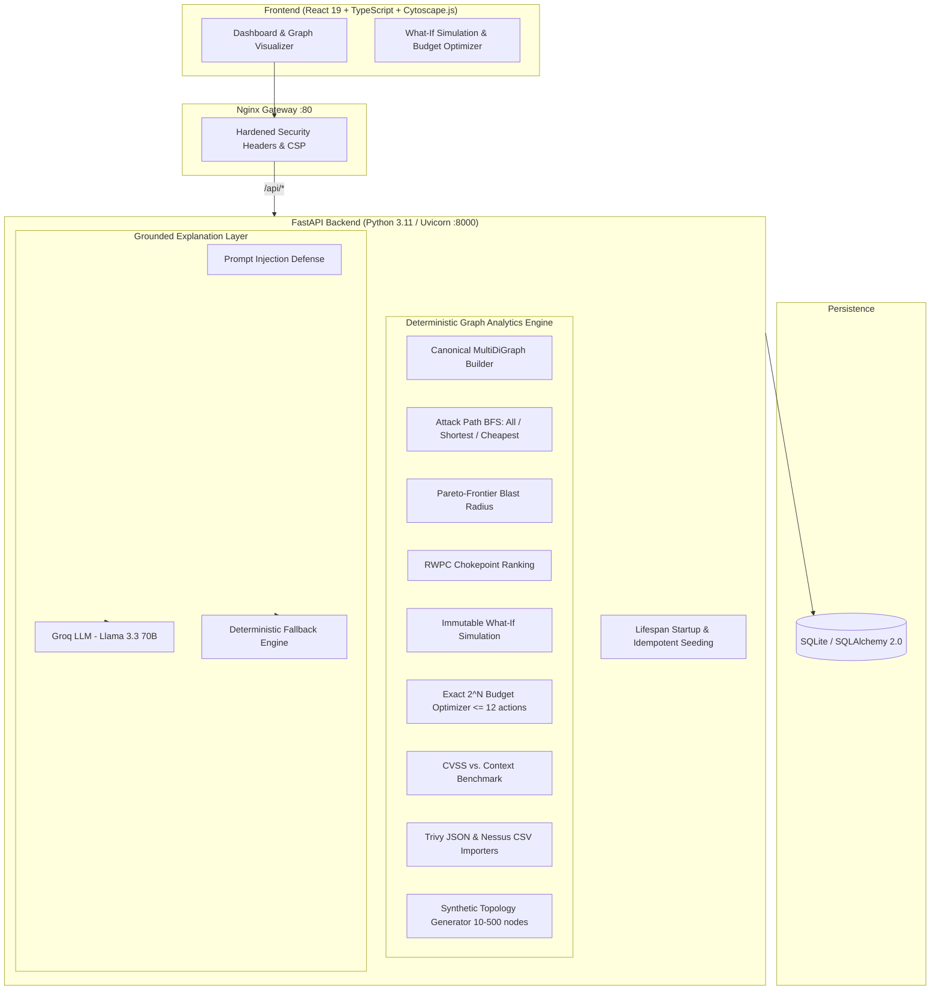

# RiskPath AI — Context-Aware Cybersecurity Remediation Decision Support

[](https://github.com/AkshayByte/RiskPath-AI/actions/workflows/ci.yml)
[](LICENSE)
[](https://www.python.org/)
[](https://fastapi.tiangolo.com/)
[](https://react.dev/)
[](https://www.typescriptlang.org/)
[](backend/tests)
[](https://www.docker.com/)

**RiskPath AI** is a graph-based decision-support system for one fundamental security question:

> **When you cannot fix everything, which remediations cut the most real, reachable risk to your crown jewels?**

Instead of ranking vulnerabilities by isolated CVSS severity, RiskPath AI models enterprise topologies as canonical multi-hop attack graphs in NetworkX, discovers feasible entry-point → crown-jewel trajectories, ranks topological chokepoints by Risk-Weighted Path Criticality (RWPC), runs exact deterministic what-if remediation simulations on deep graph clones, and solves combinatorial budget optimization problems.

---

## System Architecture



---

## Formal Mathematical Formulation

### 1. Canonical Graph Representation

An enterprise threat model is a directed multigraph $G = (V, E)$:
- $V = V_{\text{asset}} \cup V_{\text{finding}}$ — assets (hosts, databases) and observed vulnerability findings.
- $E \subseteq V \times V \times \mathcal{T}$ — attack transitions typed as `EXPLOITS`, `CAN_REACH`, `LATERAL_MOVEMENT`, `PRIVILEGE_ESCALATION`, `CREDENTIAL_ACCESS`, or `TRUSTED_ACCESS`.
- Each edge $e$ has cost $c(e) \in [0, \infty)$ and transition probability $p(e) \in (0, 1]$.

### 2. Attack Path Feasibility

$$F(P) = \left( \prod_{i=1}^{k} p(e_i) \right) \cdot \frac{1}{1 + \sum_{i=1}^{k} c(e_i)}$$

### 3. Blast Radius Pareto Frontier

$$\mathcal{F}_d(u) = \operatorname{ParetoMin}_{(C, -\Pi)} \{ (C(P), \Pi(P)) \mid \operatorname{len}(P) = d \}$$

### 4. Chokepoint Criticality (RWPC)

$$\operatorname{RWPC}(v) = \frac{\sum_{P \in \mathcal{P}(v)} F(P) \cdot \operatorname{Crit}(\text{target}(P))}{\sum_{P \in \mathcal{P}} F(P) \cdot \operatorname{Crit}(\text{target}(P))}$$

### 5. Exact Budget Optimization

$$\max_{A^* \subseteq A} \Big( \Delta|\mathcal{P}(A^*)|,\; \Delta\sum F(P) \Big) \quad \text{s.t.} \quad \sum_{a \in A^*} \operatorname{cost}(a) \le B, \quad |A| \le 12$$

---

## Empirical Head-to-Head Benchmark

| Metric | Isolated CVSS Ranking | Context-Aware (RiskPath) | Advantage |
| :--- | :---: | :---: | :---: |
| Prioritization criterion | CVSS score descending | Path feasibility + RWPC | Real reachability |
| Path reduction efficiency | 0.101 paths / $ | **0.588 paths / $** | **+482% per dollar** |
| Crown jewels protected | Partial | **100% — zero residual paths** | Complete coverage |
| Strategy | Fixes high CVSS in isolation | Targets structural chokepoints | Minimal cost, maximum cut |

---

## Quick Start

### Option 1: Docker Compose (Recommended)

```bash
git clone https://github.com/AkshayByte/RiskPath-AI.git
cd RiskPath-AI
docker compose up --build
```

| Endpoint | URL |
| :--- | :--- |
| Frontend Application | http://localhost:8080 |
| Backend Swagger API | http://localhost:8000/docs |
| Health Check | http://localhost:8000/api/health |

### Option 2: Local Development

#### Backend
```bash
python -m venv .venv
# Windows: .venv\Scripts\Activate.ps1   macOS/Linux: source .venv/bin/activate
pip install -r requirements.txt -r requirements-dev.txt
pip install -e .

# Start backend (auto-seeds demo data on first run)
uvicorn backend.app.main:app --reload --port 8000
```

#### Frontend
```bash
cd frontend
npm install
npm run dev
```

---

## Testing & Property Verification

The repository ships **261 automated tests** covering unit, integration, and property-based invariants.

```bash
# All backend tests
pytest backend/tests -v

# Property-based invariants only (Hypothesis)
pytest backend/tests/test_hypothesis_properties.py -v

# Frontend lint and production build
npm --prefix frontend run lint
npm --prefix frontend run build
```

### Property-Based Invariants Verified

1. **Simulation monotonicity** — remediation never increases attack paths ($P_{\text{remediated}} \le P_{\text{baseline}}$).
2. **Budget admissibility** — optimizer never exceeds the budget ($\sum \operatorname{cost}(a_i) \le B$).
3. **Chokepoint bounds** — RWPC is strictly in $[0.0, 1.0]$.
4. **Blast radius completeness** — reachable assets bounded in $[1, |V_{\text{asset}}|]$.
5. **Generator scalability** — valid connected multi-tier topologies from 10 to 500 nodes.

---

## Modular API Structure

The backend mounts 14 dedicated `APIRouter` modules from `backend/app/main.py`:

| Router | Route prefix | Responsibility |
| :--- | :--- | :--- |
| `routers/health.py` | `/api/health` | Service health status |
| `routers/scenarios.py` | `/api/scenarios` | Scenario lifecycle |
| `routers/entities.py` | `/api/assets`, `/api/findings`, `/api/remediations`, `/api/edges` | Entity queries |
| `routers/graph.py` | `/api/scenarios/{id}/graph` | Graph serialization |
| `routers/paths.py` | `/api/scenarios/{id}/attack-paths` | Multi-hop BFS enumeration |
| `routers/blast_radius.py` | `/api/scenarios/{id}/blast-radius` | Pareto blast radius |
| `routers/chokepoints.py` | `/api/scenarios/{id}/chokepoints` | RWPC bottleneck ranking |
| `routers/prioritization.py` | `/api/scenarios/{id}/prioritization` | Context-aware ordering |
| `routers/simulation.py` | `/api/scenarios/{id}/simulate-remediations` | What-if simulation |
| `routers/optimization.py` | `/api/scenarios/{id}/budget-optimization` | Exact knapsack search |
| `routers/explanation.py` | `/api/scenarios/{id}/explain` | Grounded LLM explanations |
| `routers/benchmark.py` | `/api/scenarios/{id}/benchmark` | CVSS vs. context comparison |
| `routers/generator.py` | `/api/scenarios/generate-synthetic` | Synthetic graph generation |
| `routers/importers.py` | `/api/scenarios/{id}/import/*` | Trivy JSON & Nessus CSV ingestion |

---

## Security & Hardening

1. **Non-root Docker containers** — both images run as `appuser:appgroup` (UID/GID 10001).
2. **Hardened Nginx** — `Content-Security-Policy`, `X-Frame-Options: DENY`, `X-Content-Type-Options: nosniff`, `Referrer-Policy: strict-origin-when-cross-origin`, `client_max_body_size 15M`.
3. **Prompt injection defence** — entity names are sanitized and fenced in `<evidence_context>` tags before reaching the LLM.
4. **Deterministic decision core** — the LLM is used only for human-readable explanations; all prioritization, simulation, and optimization logic is 100% deterministic and mathematically verified.

---

## Limitations & Assumptions

| Item | Detail |
| :--- | :--- |
| **Optimizer ceiling** | Exact $O(2^N)$ enumeration is capped at $\|A\| \le 12$ actions (~4 096 states). For larger action sets use the greedy ordering from the context-aware prioritization endpoint. |
| **Path search bounds** | BFS is limited to `max_depth = 10` hops and `max_paths = 100` results per scenario to prevent combinatorial explosion in dense graphs. |
| **Synthetic data** | The built-in seed scenario and synthetic generator produce realistic but artificial topologies. Results should be validated against real asset inventories before operational use. |
| **Scanner support** | Built-in importers handle Trivy JSON and Nessus / OpenVAS CSV (up to 5 000 assets and 50 000 findings per import). |
| **No authentication** | The API has no auth layer. Do not expose it on a public network without adding a reverse-proxy auth mechanism. |
| **Single-user storage** | SQLite is used for simplicity. Replace with PostgreSQL for concurrent or multi-user deployments. |
| **CVSS baseline** | Scoring assumptions use static CVSS v3.1 base scores. EPSS and CISA KEV enrichment is not yet automated; values in the seed data are manually curated. |

---

## Technical Documentation

Extended specifications are available in the [`docs/`](docs/) directory:

- [`docs/architecture.md`](docs/architecture.md) — Component responsibilities and data-flow diagram.
- [`docs/graph_schema.md`](docs/graph_schema.md) — Node types, edge semantics, and validation rules.
- [`docs/math_formulation.md`](docs/math_formulation.md) — Full mathematical derivations for RWPC, blast radius Pareto frontier, and the exact optimizer.

---

## License

This project is open-source software licensed under the [MIT License](LICENSE).
