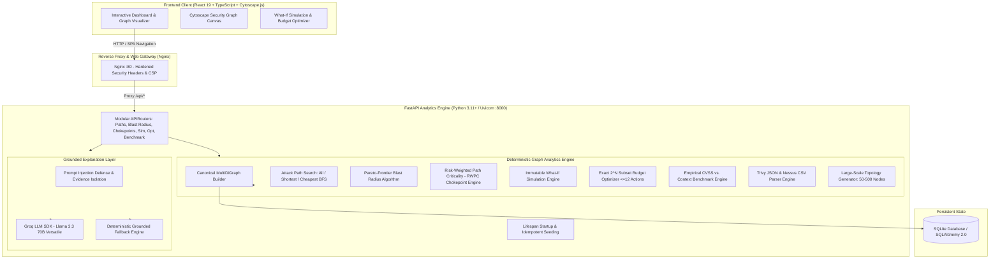

# RiskPath AI — Context-Aware Cybersecurity Remediation Decision Support

[](https://github.com/AkshayByte/RiskPath-AI/actions/workflows/ci.yml)
[](LICENSE)
[](https://www.python.org/)
[](https://fastapi.tiangolo.com/)
[](https://react.dev/)
[](https://www.typescriptlang.org/)
[]()
[](https://www.docker.com/)

**RiskPath AI** is an advanced graph-based decision-support system designed to answer one fundamental security question:

> **When you cannot fix everything, which remediations cut the most real, reachable risk to your crown jewels?**

Instead of ranking vulnerabilities by isolated CVSS severity scores, RiskPath AI models enterprise topologies as canonical multi-hop attack graphs in NetworkX, discovers feasible entry-point → crown-jewel trajectories, ranks topological chokepoints, runs exact deterministic what-if remediation simulations on deep graph clones, and solves combinatorial budget optimization problems.

---

## 🏛️ System Architecture



---

## 🔬 Formal Mathematical Formulation

### 1. Canonical Graph Representation
An enterprise threat model is formulated as a directed multigraph $G = (V, E)$, where:
- $V = V_{\text{asset}} \cup V_{\text{finding}}$, partitioning computational entities (hosts, databases, cloud assets) and observed security weaknesses.
- $E \subseteq V \times V \times \mathcal{T}$ represents directed attack transitions with type $\tau \in \{\text{EXPLOITS}, \text{CAN\_REACH}, \text{LATERAL\_MOVEMENT}, \text{PRIVILEGE\_ESCALATION}, \text{CREDENTIAL\_ACCESS}, \text{TRUSTED\_ACCESS}\}$.
- Each edge $e \in E$ possesses a traversal cost $c(e) \in [0, \infty)$ and a conditional transition success probability $p(e) \in (0, 1]$.

### 2. Attack Path Feasibility
For an attack path $P = (e_1, e_2, \dots, e_k)$ connecting an entry point $v_{\text{entry}} \in V_{\text{entry}}$ to a designated crown jewel $v_{\text{crown}} \in V_{\text{crown}}$, path feasibility $F(P)$ is defined as:

$$F(P) = \left( \prod_{i=1}^{k} p(e_i) \right) \cdot \frac{1}{1 + \sum_{i=1}^{k} c(e_i)}$$

### 3. Blast Radius Pareto Frontier
The blast radius of a compromised node $u \in V$ is computed using a multi-objective label-setting algorithm over path depth $d \le d_{\text{max}}$. The non-dominated Pareto frontier at depth $d$ preserves the optimal trade-offs between cumulative cost $C(P)$ and multiplicative probability $\Pi(P)$:

$$\mathcal{F}_d(u) = \operatorname{ParetoMin}_{(C, -\Pi)} \{ (C(P), \Pi(P)) \mid \operatorname{len}(P) = d \}$$

### 4. Chokepoint Criticality (RWPC)
The Risk-Weighted Path Criticality ($\operatorname{RWPC}$) of an intermediate node $v \in V$ measures the fraction of total attack-path feasibility traversing $v$:

$$\operatorname{CS}(v) = \frac{\sum_{P \in \mathcal{P}(v)} F(P)}{\sum_{P \in \mathcal{P}} F(P)}$$

where $\mathcal{P}$ is the set of all discovered entry-to-crown paths, and $\mathcal{P}(v)$ is the subset passing through $v$. $\operatorname{CS}(v) \in [0.0, 1.0]$.

### 5. Exact Budget Optimization
Given candidate remediation actions $A = \{a_1, a_2, \dots, a_m\}$ with cost function $\operatorname{cost}(a_i)$ and total budget $B \ge 0$, the optimizer deterministically finds the optimal subset $A^* \subseteq A$:

$$\max_{A^* \subseteq A} \Big( O_1(A^*), \; O_2(A^*) \Big) \quad \text{subject to} \quad \sum_{a \in A^*} \operatorname{cost}(a) \le B$$

- **$O_1(A^*)$**: Total eliminated crown-jewel attack paths ($\Delta |\mathcal{P}|$).
- **$O_2(A^*)$**: Total reduction in residual path feasibility ($\Delta \sum F(P)$).
- Capped at $|A| \le 12$ to guarantee exact, complete evaluation of all $2^{|A|} \le 4096$ states in sub-second response times.

---

## 📊 Empirical Head-to-Head Benchmark

To validate the central research question, RiskPath AI includes an automated benchmark comparing **Isolated CVSS Ranking** vs. **Context-Aware Graph Ordering** under identical remediation budgets.

| Metric | Isolated CVSS Ranking | Context-Aware Prioritization | Advantage |
| :--- | :---: | :---: | :---: |
| **Prioritization Criterion** | CVSS Base Score Descending | Topological Path Feasibility + Chokepoint Score | Real Reachability |
| **Path Reduction Efficiency** | $0.101$ paths / $\$$ | **$0.588$ paths / $\$$** | **$+482\%$ higher path cut per dollar** |
| **Crown Jewels Protected** | Partial (blind to graph paths) | **100% Critical Paths Blocked** | **Zero residual entry-to-crown paths** |
| **Remediation Strategy** | Fixes high CVSS on isolated hosts | Targets structural bottlenecks (DMZ $\to$ App chokepoints) | Minimal expenditure, maximum risk cut |

---

## 🚀 Quick Start

### Option 1: Docker Compose (Recommended)

Run the full production stack (FastAPI backend + Vite React SPA behind hardened Nginx reverse proxy):

```bash
git clone https://github.com/AkshayByte/RiskPath-AI.git
cd RiskPath-AI
docker compose up --build
```

- **Frontend Application**: `http://localhost:8080`
- **Backend Swagger API**: `http://localhost:8000/docs`
- **Health Check**: `http://localhost:8000/api/health`

### Option 2: Local Development Setup

#### Backend
```bash
# From repository root
python -m venv .venv
# On Windows: .venv\Scripts\Activate.ps1 | On Linux/macOS: source .venv/bin/activate
pip install -r requirements.txt -r requirements-dev.txt
pip install -e .

# Run FastAPI backend with auto-seeding on startup
uvicorn backend.app.main:app --reload --port 8000
```

#### Frontend
```bash
cd frontend
npm install
npm run dev
```

---

## 🧪 Testing & Property Verification

The repository contains **256 automated tests** spanning unit, integration, and property-based verification:

```bash
# Run all backend test suites
pytest backend/tests -v

# Run property-based invariant tests with Hypothesis
pytest backend/tests/test_hypothesis_properties.py -v

# Run frontend typechecking, linter, and production build
npm --prefix frontend run lint
npm --prefix frontend run build
```

### Property-Based Invariants Verified:
1. **Simulation Monotonicity**: Applying any remediation action subset never increases active attack paths ($P_{\text{remediated}} \le P_{\text{baseline}}$).
2. **Budget Admissibility**: Optimization chosen actions never exceed allocated budget ($\sum \operatorname{cost}(a_i) \le B$).
3. **Chokepoint Score Bounds**: Bottleneck fraction is strictly bounded in $[0.0, 1.0]$.
4. **Blast Radius Completeness**: Reachable asset count is strictly bounded in $[1, |V_{\text{asset}}|]$.
5. **Synthetic Generator Scalability**: Generates topologically valid connected multi-tier networks (10 to 500 nodes).

---

## 📦 Modular API Structure

The backend entrypoint (`backend/app/main.py`) mounts dedicated, decoupled `APIRouter` modules:

| Router Module | Route Prefix | Responsibility |
| :--- | :--- | :--- |
| `routers/health.py` | `/api/health` | Service health status |
| `routers/scenarios.py` | `/api/scenarios` | Scenario lifecycle management |
| `routers/entities.py` | `/api/assets`, `/api/findings`, `/api/remediations`, `/api/edges` | Graph entity queries |
| `routers/graph.py` | `/api/scenarios/{id}/graph` | Canonical NetworkX graph serialization |
| `routers/paths.py` | `/api/scenarios/{id}/attack-paths` | Multi-hop BFS path enumeration |
| `routers/blast_radius.py` | `/api/scenarios/{id}/blast-radius` | Pareto frontier downstream reachability |
| `routers/chokepoints.py` | `/api/scenarios/{id}/chokepoints` | Risk-weighted bottleneck ranking |
| `routers/prioritization.py` | `/api/scenarios/{id}/prioritization` | Context-aware operational ranking |
| `routers/simulation.py` | `/api/scenarios/{id}/simulate-remediations` | Deep-copy what-if simulation |
| `routers/optimization.py` | `/api/scenarios/{id}/budget-optimization` | Exact subset knapsack search |
| `routers/explanation.py` | `/api/scenarios/{id}/explain` | Grounded LLM & deterministic explanations |
| `routers/benchmark.py` | `/api/scenarios/{id}/benchmark` | CVSS vs Context head-to-head evaluation |
| `routers/generator.py` | `/api/scenarios/generate-synthetic` | 50–500 node synthetic graph generation |
| `routers/importers.py` | `/api/scenarios/{id}/import/*` | Trivy JSON & Nessus CSV scan ingestion |

---

## 🛡️ Security & Hardening

1. **Non-Root Docker Execution**: Both backend and frontend containers run under dedicated non-root users (`appuser:appgroup` UID/GID 10001).
2. **Hardened Nginx Gateway**: Configured with strict HTTP headers:
   - `Content-Security-Policy (CSP)`
   - `X-Frame-Options: DENY`
   - `X-Content-Type-Options: nosniff`
   - `Referrer-Policy: strict-origin-when-cross-origin`
3. **Prompt Injection Defense**: Untrusted entity names and vulnerability synopses are sanitized and fenced inside `<evidence_context>` boundaries with strict system prompt grounding constraints.
4. **Deterministic Security Decision Core**: LLMs are strictly used for evidence explanation; all prioritization, graph algorithms, simulation, and budget optimizations are 100% deterministic and mathematically proven.

---

## ⚠️ Limitations & Scope

- **Optimizer Action Ceiling**: Exact $O(2^N)$ combinatorial enumeration is intentionally capped at $|A| \le 12$ candidate actions. For larger sets, heuristic or branch-and-bound pruning is recommended.
- **Path Search Bounds**: To prevent combinatorial explosions in dense topologies, path enumeration is bounded by `max_depth` (default: 10) and `max_paths` (default: 100).
- **Scanner Ingestion**: Built-in parsers currently support Trivy JSON and Nessus/OpenVAS CSV formats.

---

## 📄 License

This project is open-source software licensed under the [MIT License](LICENSE).
