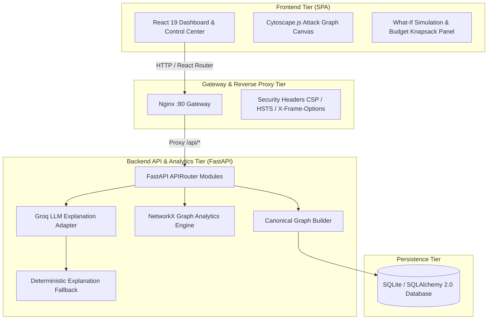

# RiskPath AI — Architecture Specification

## 1. System Overview

RiskPath AI is structured into three decoupled tiers:

---

## 2. Component Responsibilities

### 2.1 Frontend Tier (`/frontend`)
- **Technology Stack**: React 19, TypeScript, Vite, Cytoscape.js, Lucide Icons, Vanilla CSS Design System.
- **Role**: Pure visualization and interactive exploration. Zero security score calculations occur on the client.
- **Key Modules**:
  - `CytoscapeCanvas.tsx`: Multi-tier hierarchical layout with real-time path highlights, blast radius halos, and chokepoint glows.
  - `SimulationPanel.tsx`: Interactive toggle of remediation actions with live recalculation of residual paths.
  - `BudgetOptimizerPanel.tsx`: Knapsack search UI for budget-constrained risk reduction.
  - `BenchmarkView.tsx`: Head-to-head empirical evaluation of Isolated CVSS vs. Context-Aware ordering.
  - `ScannerImportModal.tsx`: Direct upload of Trivy JSON and Nessus CSV scanner reports.

### 2.2 Reverse Proxy Tier (`frontend/nginx.conf`)
- **Web Server**: Serves production build of the SPA.
- **Proxy**: Directs all `/api/*` traffic to the backend on `http://backend:8000`.
- **Hardening**:
  - `client_max_body_size 15M;` (accommodates enterprise vulnerability scans).
  - Strict security headers (`X-Frame-Options: DENY`, `X-Content-Type-Options: nosniff`, `Content-Security-Policy`).

### 2.3 Backend Tier (`/backend`)
- **Technology Stack**: FastAPI, Python 3.11+, SQLAlchemy 2.0, NetworkX, Pydantic v2, Groq SDK.
- **Modular Router Layout**:
  - `routers/scenarios.py`: Scenario lifecycle.
  - `routers/paths.py`: Multi-hop BFS attack path enumeration.
  - `routers/blast_radius.py`: Pareto-frontier blast radius exploration.
  - `routers/chokepoints.py`: Risk-Weighted Path Criticality (RWPC) ranking.
  - `routers/prioritization.py`: Context-aware operational ordering.
  - `routers/simulation.py`: Deep-copy what-if remediation simulation.
  - `routers/optimization.py`: Exact combinatorial knapsack optimizer ($|A| \le 12$).
  - `routers/explanation.py`: Grounded AI explanation layer with deterministic fallback.
  - `routers/benchmark.py`: Empirical CVSS vs. Context benchmark comparison.
  - `routers/importers.py`: Trivy JSON and Nessus CSV parsers.
  - `routers/generator.py`: Reproducible synthetic topology generator ($N \in [10, 500]$, `seed`).

---

## 3. Grounded Explanation Security Layer

To prevent hallucinations and prompt injection attacks:
1. **Evidence Grounding**: The LLM prompt receives strictly structured, pre-computed graph metrics (hop counts, entry points, crown jewels, chokepoint scores, eliminated paths).
2. **Isolation & Fencing**: Entity names and descriptions are sanitized and fenced inside `<evidence_context>` tags.
3. **Deterministic Fallback**: If no Groq API key is configured or the upstream API is unavailable, the backend seamlessly falls back to a deterministic template generator producing accurate, mathematically verified textual explanations.
