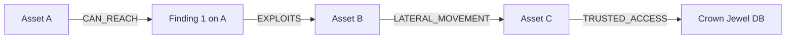

# RiskPath AI — Security Graph Schema

## 1. Graph Entity Types (Nodes)

The canonical attack graph is constructed as a NetworkX `MultiDiGraph` containing three primary node classes:

| Node Type | Primary Attributes | Description |
| :--- | :--- | :--- |
| `asset` | `id`, `name`, `type`, `criticality` (1.0–10.0), `network_zone`, `environment`, `is_entry_point`, `is_crown_jewel`, `ip_address` | Infrastructure components (servers, databases, gateways, workstations). |
| `finding` | `id`, `asset_id`, `vulnerability_id`, `port`, `service_name`, `status` | An observed vulnerability instance on a specific asset. |
| `vulnerability` | `id`, `cve_id`, `cvss_score`, `severity`, `attack_vector`, `attack_complexity`, `known_exploited` (KEV), `epss_score` | Universal weakness definition. |

---

## 2. Attack Transition Types (Edges)

Edges represent directional attack steps with explicit cost $c(e) \in [0, \infty)$ and transition probability $p(e) \in (0, 1]$:

### Edge Semantics & Base Parameters

| Edge Type | Valid Node Endpoints | Default Cost $c(e)$ | Default Prob $p(e)$ | Cyber Meaning |
| :--- | :--- | :---: | :---: | :--- |
| `CAN_REACH` | `asset -> asset` `asset -> finding` `finding -> asset` | $1.0$ | $0.90$ | Network visibility / service accessibility. |
| `EXPLOITS` | `finding -> asset` | $2.0$ | $0.60$ | Exploiting a vulnerability to achieve access. |
| `LATERAL_MOVEMENT` | `asset -> asset` `finding -> finding` | $2.5$ | $0.70$ | Moving sideways across network segments. |
| `PRIVILEGE_ESCALATION` | `asset -> asset` `finding -> finding` | $3.0$ | $0.50$ | Elevating from user to root/admin privileges. |
| `CREDENTIAL_ACCESS` | `finding -> asset` `asset -> asset` | $2.0$ | $0.75$ | Dumping credentials or token reuse. |
| `TRUSTED_ACCESS` | `asset -> asset` | $1.0$ | $0.95$ | Inherent architectural trust (e.g. App to DB). |

---

## 3. Structural Validation Rules

The canonical graph builder validates every constructed graph against the following invariants:

1. **No Dangling References**: All edge endpoints must exist as registered nodes in the graph.
2. **Valid Node Type Pairings**: Edge types must strictly match allowable source/target node combinations (e.g., `EXPLOITS` edges must originate from a `finding` node).
3. **Probability & Cost Bounds**: Every edge must satisfy $p(e) \in (0.0, 1.0]$ and $c(e) \ge 0.0$.
4. **Disjoint Entry/Crown Roles**: No node may simultaneously serve as both an external entry point and a protected crown jewel.
